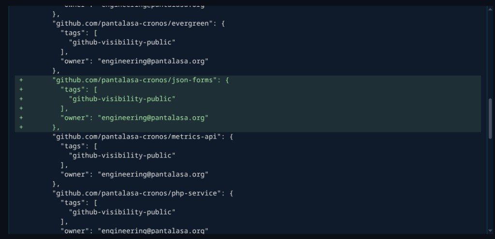

# earthly-textdiff-panel

Grafana panel plugin that renders a line-by-line text diff from two columns. The
user-facing documentation shown in the Grafana catalog lives in
[`src/README.md`](./src/README.md).



This repository is built with
[`@grafana/create-plugin`](https://github.com/grafana/plugin-tools) and follows
the standard Grafana plugin tooling.

## Development

```bash
npm ci            # install dependencies
npm run dev       # build in watch mode
npm run test:ci   # unit tests (Jest)
npm run typecheck # type-check
npm run lint      # lint
npm run build     # production build into dist/
npm run server    # run a local Grafana with the plugin (Docker)
npm run e2e       # end-to-end tests (Playwright)
```

## Releasing and signing

Pushing a `v*` tag triggers `.github/workflows/release.yml`, which builds, signs
(via `@grafana/sign-plugin`), and packages the plugin. Signing requires a
`GRAFANA_CLOUD_SIGNING_TOKEN` repository secret, created from a Grafana Cloud
access policy (scope `plugins:write`) under the `earthly` org.

## License

[MIT](./LICENSE).
